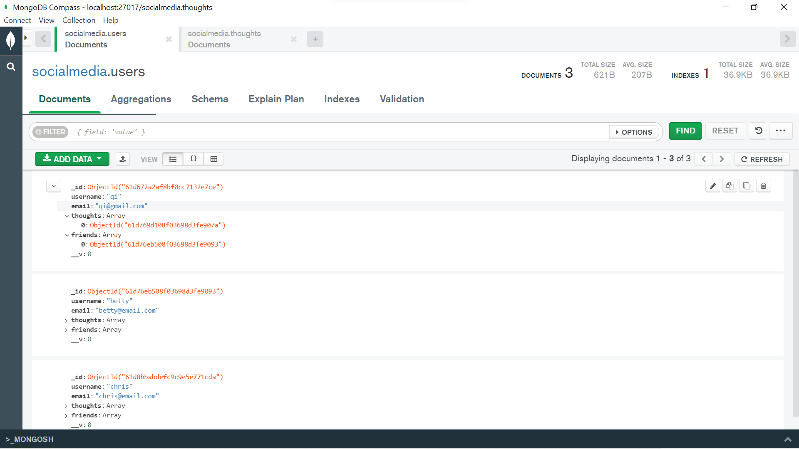
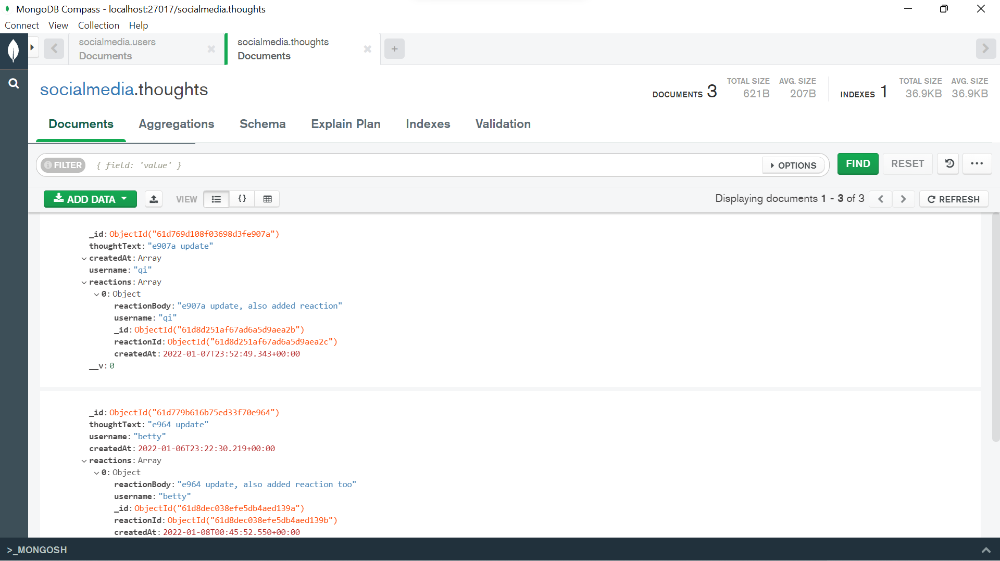
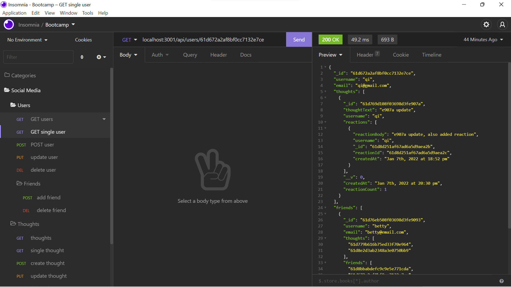
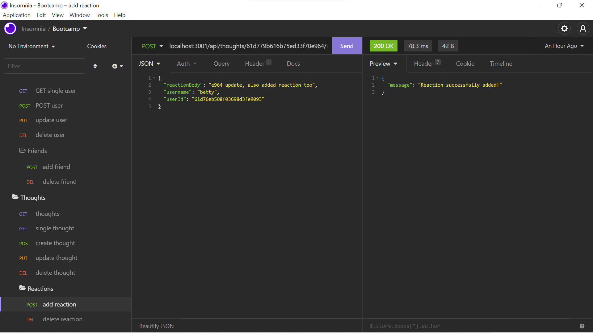

# Social Network API Using MongoDB

 

- [Description](#description)
- [Installations](#installations)
- [Screenshots](#screenshots)
- [Video](#video)
- [Lincense](#license)
- [Contributing](#contributing)
- [Questions](#questions)

## Description

This project uses Express, MongoDB and Mongoose ODM to build an API for social network web applications. Users are able to share their thoughts, react to friends' thoughts, and create a friend list.

## Installations

npm install

## Screenshots

MongoDB Compass Databse with Users Field

MongoDB Compass Databse with Thoughts Field

Insomnia GET Method of Single User

Insomnia POST Method of Reactions

## Video

Click [here](https://watch.screencastify.com/v/Vjb1B5TvXruDkddy3P1A)!

## License

 
Copyright © 2022 [Betty Chen](https://github.com/bchen41).  
This project is [MIT](https://github.com/bchen41/mongo-social-network-api/blob/main/LICENSE) licensed.

## Contributing

All are welcomed to contribute as long as the standard industry guidelines are being followed.
Click [here](https://www.contributor-covenant.org/) for industry standard guidelines.

## Questions

For additional questions, contact me by reaching me at my [email](mailto:bettychen41@outlook.com).

You can find my other projects at my [GitHub](https://github.com/bchen41) profile.

Author: Betty Chen
